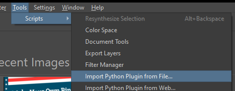

# Krita Resynthesizer Plugin
This plugin brings texture synthesis/inpainting capabilities to Krita using the Python [resynthesizer](https://github.com/light-and-ray/resynthesizer-python-lib) package. It allows you to remove objects or fill gaps by selecting an area and generating new textures based on the surrounding pixels. This uses an old algorithm Photoshop's Content Aware Fill was based on.

## DEV NOTES
- [plugin docs](https://docs.krita.org/en/user_manual/python_scripting/krita_python_plugin_howto.html#creating-configurable-keyboard-shortcuts)

## Features
- [x] Inpaint selected region with `resynthesizer`.
- [x] Control context padding for inpainting.
- [x] Remember user settings.
- [x] Option to inpaint on currently selected layer or create a new layer
- [ ] Undo support.
    - As far as I am aware, Krita does not expose a way to support this currently.
- [ ] Interface for painting the context region like in photoshop.

## Installation
### Prerequisites & Important Notes
- Krita 5.0+.
- This has only been tested on `Windows 10`, but will likely work on other platforms.
- This project vendors the `pillow` and `resynthesizer` projects from `pypi`.

### Setup
- Download [the latest .zip archive of this package](https://github.com/CodePeasants/krita_resynthesizer/releases/latest/download/krita_resynthesizer.zip).
- Open Krita.
- Go to **Tools** -> **Scripts** -> **Import Python Plugin from File...** and select the `.zip` archive.

- Accepts the prompts to load the plugin.
- Restart Krita.

### Validate Install on Windows
- `.action` file should install to: `AppData/Roaming/krita/actions`
- Python files install to: `AppData/Roaming/krita/pykrita`

## Usage
- Open an image.
- Select the layer you want to modify.
- Use any Selection Tool (Rectangular, Lasso, etc.) to select the object you want to remove or the area you want to fill.
- Run Resynthesizer via any of these methods:
    - Go to: **Tools** -> **Scripts** -> **Resynthesize Selection**
    - Go to: **Settings** -> **Dockers** -> **Resynthesizer**, then press the **Resynthesize Selection** button in the docker window.
    - **Shift** + **Backspace** hotkey (or configure a custom hotkey in keybindings).

## Troubleshooting
- "Missing Library" Error: Ensure you ran the pip install command using the specific python executable found inside Krita's installation folder, not your system-wide python.
- Crash/Freeze: Synthesis on large 4K+ images can be slow. Try selecting smaller areas.

## Attribution
- It's amazing we have such a great free app, kudos to [Krita](https://krita.org/en/)!
- All credit to the original [resynthesizer project](https://github.com/light-and-ray/resynthesizer-python-lib), `Krita Resynthesizer` is just a wrapper to expose an interface in Krita.

## Developer Resources
- [Krita Python API Docs](https://knowzero.github.io/Krita-PythonPluginDeveloperTools/plugindevtools/PluginDevTools/kritadoc.html)
- [Krita Plugin Docs](https://docs.krita.org/en/user_manual/python_scripting/krita_python_plugin_howto.html#creating-an-extension)
